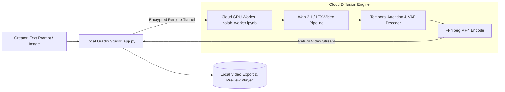

# 🎥 AI Video Generation Studio

<div align="center">

[](LICENSE)
[](https://github.com/Kamran5H/VideoStudio)
[](https://gradio.app/)
[](https://github.com/Kamran5H/VideoStudio)
[](https://github.com/Kamran5H/VideoStudio)

**High-fidelity AI Text-to-Video and Image-to-Video generation studio featuring a Gradio interface and zero-cost cloud GPU worker bridge.**

[Features](#-key-features) • [Architecture](#-architecture) • [Cloud Acceleration](#-free-cloud-gpu-acceleration) • [Installation](#-installation) • [License](#-license)

</div>

---

## 🌟 Executive Overview

**VideoStudio** is a state-of-the-art AI video synthesis suite that enables creators, developers, and researchers to generate cinematic 1080p and 4K video clips directly from text prompts or still images. Engineered in Python with a rich **Gradio UI**, VideoStudio bridges local workstation controls with **free cloud GPU backends** (e.g. Google Colab T4/A100) to render state-of-the-art diffusion models (Wan 2.1, LTX-Video) without requiring a multi-thousand-dollar local GPU.

---

## 🚀 Key Features

- **🎬 Multi-Modal Video Synthesis**:
  - **Text-to-Video (T2V)**: Generates fluid, temporally coherent video sequences from descriptive natural language prompts.
  - **Image-to-Video (I2V)**: Animates still photographs, digital art, or AI portraits with cinematic motion trajectories.
- **⚡ Free Cloud GPU Acceleration (`colab_worker.ipynb`)**: Offload massive VRAM compute requirements to free Google Colab cloud instances via automated tunneling (Ngrok / Gradio link), keeping your local machine completely unburdened.
- **🎨 Modern Gradio Interactive Studio**:
  - Resolution controls (480p, 720p, 1080p)
  - Frame rate configuration (24fps, 30fps) and duration sliders
  - Guidance scale, motion bucket ID, and seed randomization
  - Built-in video preview player with instant download
- **🖥️ Turnkey Windows Launch**: Pre-configured `Start Video Studio.bat` and silent `run_videostudio.vbs` for one-click desktop initiation.

---

## 🏗️ Architecture



---

## 📁 Repository Structure

```text
VideoStudio/
├── app.py                      # Primary Gradio web studio interface
├── video_studio.py             # Video generation pipeline orchestrator
├── colab_worker.ipynb          # Cloud GPU worker notebook for free acceleration
├── Wan2.1-main/                # Integrated Wan2.1 diffusion model codebase
├── Start Video Studio.bat      # Windows one-click desktop launcher
├── run_videostudio.vbs         # Silent background VBS launcher
├── videostudio.ico             # High-resolution application icon
├── requirements.txt            # Python dependencies
├── .gitignore                  # Video cache and weights exclusions
└── LICENSE                     # Open-source MIT License
```

---

## ⚡ Installation

### Prerequisites
- Python 3.10 or higher
- (Optional for local inference) NVIDIA GPU with 12GB+ VRAM or free Google Colab account

### Setup
```bash
git clone https://github.com/Kamran5H/VideoStudio.git
cd VideoStudio

# Setup virtual environment
python -m venv .venv
.venv\Scripts\activate

# Install dependencies
pip install -r requirements.txt
```

### Launch
```bash
# Start local studio
python app.py

# Or double-click "Start Video Studio.bat" on Windows
```

---

## 📜 License

This project is open-source and released under the [MIT License](LICENSE).  
Copyright (c) 2024-2026 **Kamran Ashraf**.
